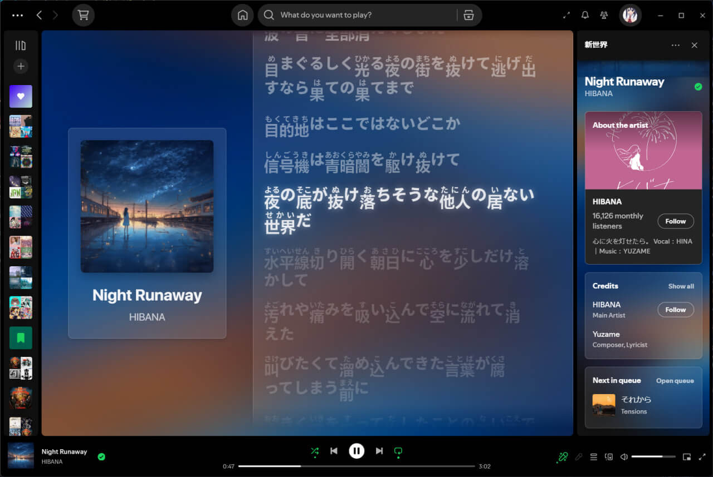
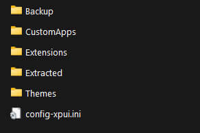
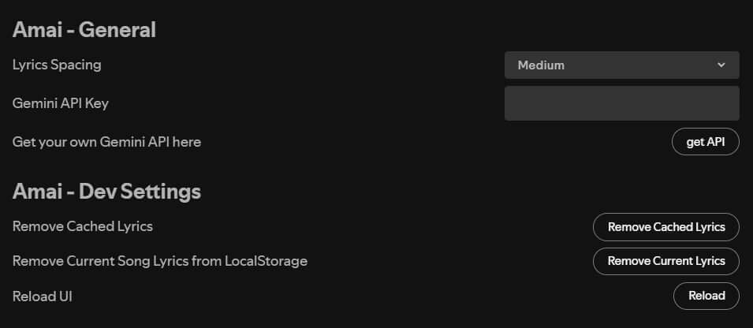
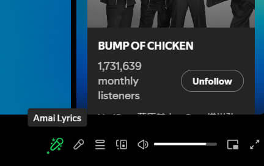

# 🎶 Amai Lyrics

An extension of Spicetify. A fork of [Spicy Lyrics](https://spicylyrics.org/) that extends the original project by adding Furigana support using the free Gemini API. This enhancement lets you display phonetic guides alongside Japanese lyrics.

## 🌟 Features

- **Furigana Support:** Annotate Kanji with phonetic guides to aid reading.
- **Gemini API Integration:** Leverages a free API to generate Furigana annotations.
- **Easy Setup:** Simply obtain your free API key from [Google AI Studio](https://aistudio.google.com/app/apikey) and follow the configuration instructions.

## 👀 Preview




## 🚀 Installation

### 🛒 Via Marketplace (Currently not available 😭)

Follow these simple steps:

1. Install [Spicetify Marketplace](https://github.com/spicetify/spicetify-marketplace) if you haven't already
2. Open Spotify and navigate to Marketplace → Extensions
3. Search for "Amai Lyrics"
4. Click **Install** to add it to Spicetify

### 🔧 Manual Installation

For manual setup:

1. Download [amai-lyrics-main.js](https://github.com/hudzax/amai-lyrics/releases/download/v1.0.21/amai-lyrics-main.js)
2. Open terminal and run this command to open/show Spicetify config directory:
   ```bash
   spicetify config-dir
   ```
3. Copy the downloaded file inside the Extensions directory:

   

4. finally, run these commands in terminal:
   ```bash
   spicetify config extensions amai-lyrics-main.js
   spicetify apply
   ```
5. Restart Spotify

## ⚙️ Configuration

Follow these steps to set up your Gemini API key:

1. **Open Spotify Settings:**
   - Launch Spotify and go to your settings.
2. **Locate the API Key Field:**
   - Scroll to the bottom of the settings page until you find the API key field.
3. **Paste Your Gemini API Key:**
   - Insert the API key into the field.
     
4. **Access the Lyrics Page:**
   - Click the lyrics icon at the bottom of the Spotify window.
   - Wait a few moments as the page loads—the Furigana annotations will appear automatically.
     

## 🌟 Future Plans

- **Line-by-Line Translation:** Add support for displaying translations for each line of lyrics.

## 🙏 Credits

Special thanks to Spikerko, creator of the original Spicy Lyrics extension.
