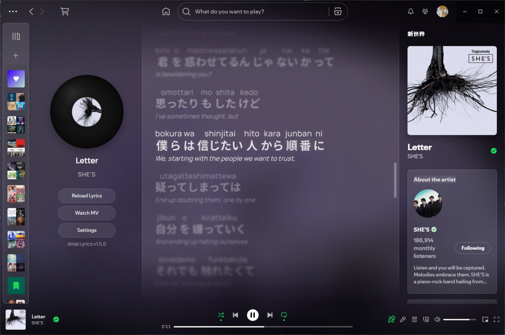
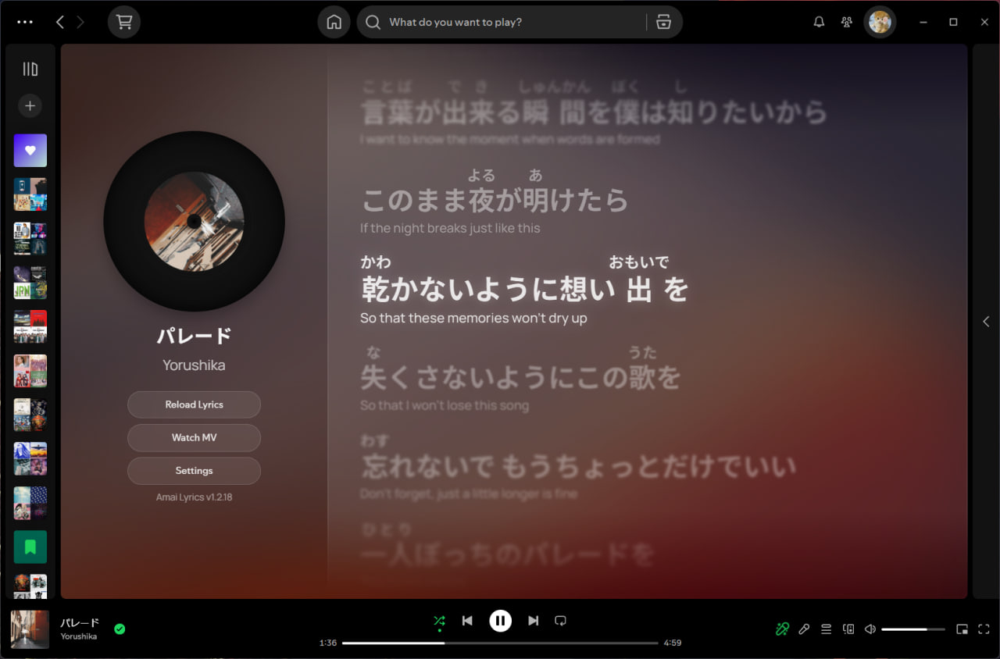
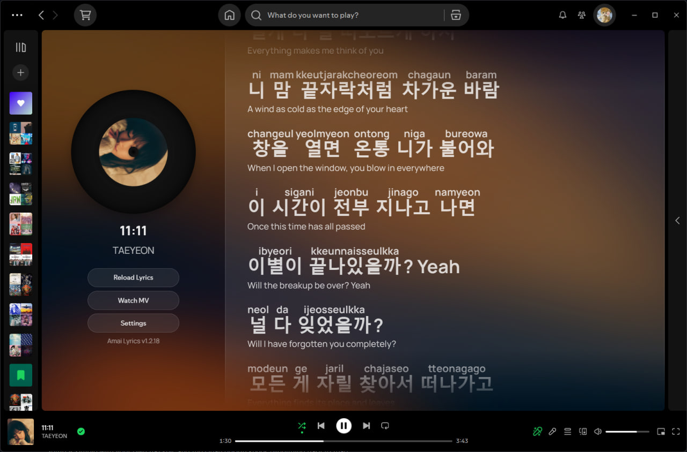
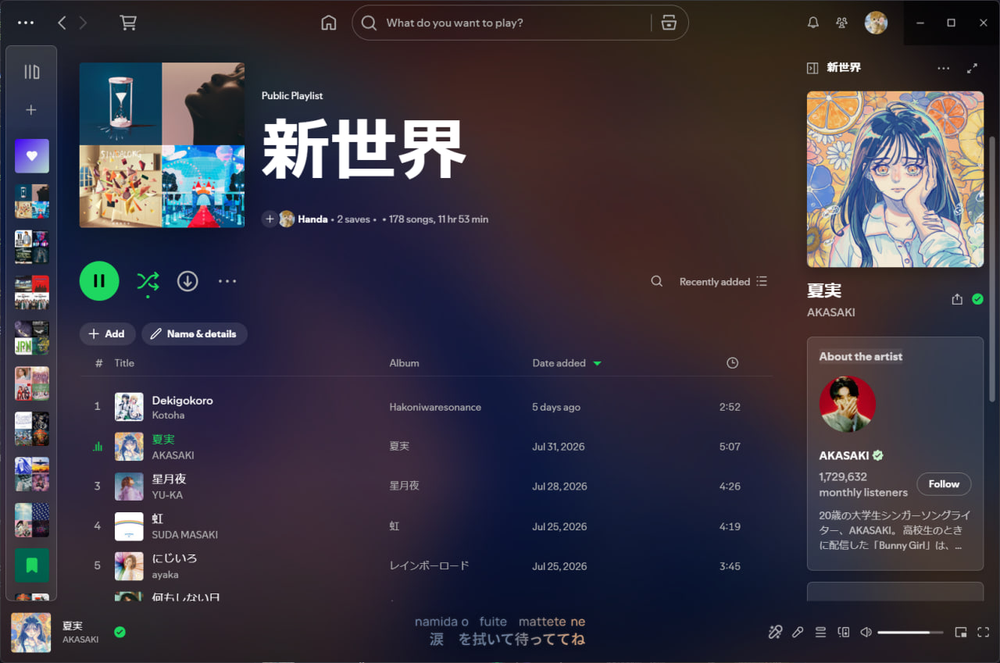
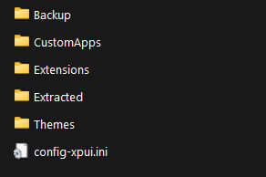
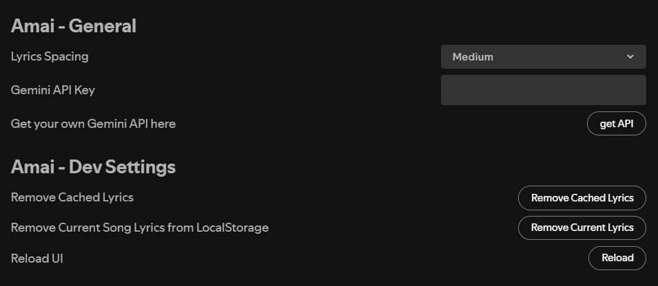
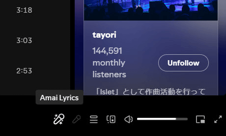

# 🎶 Amai Lyrics



**Amai Lyrics** is a [Spicetify](https://spicetify.app/) extension that makes Japanese and Korean music on Spotify easier to follow and understand.

It adds **Furigana** readings to Kanji, shows **Romaji** for Japanese and **Romanization** for Korean, and delivers **line-by-line translations** — all powered by Google's Gemini, using your own API key.

---

## ✨ Features

### Lyrics Plus

The full lyrics page, reimagined for language learners:

- **Furigana** above Japanese Kanji so you can always read them
- **Romaji** readings for Japanese lines
- **Romanization** for Korean lines
- **Line-by-line translations** synced with the music




### Playbar Lyrics

Keep the current line in view without leaving your playlist — the active lyric (with Furigana/Romaji) renders right in the Spotify playbar.


### Amai Theme

A dynamic background generated from the current song's album artwork. Off by default — flip the toggle in settings to turn your whole client into the vibe of whatever you're playing.




---

## 🌍 Translation Languages

Translate lyrics into any of:

English · Spanish · French · German · Portuguese · Chinese (Simplified) · Thai · Indonesian · Malay · Japanese · Korean

Switch the target language anytime from Spotify's settings — no reinstall needed.

## 💻 Supported Platforms

Works everywhere Spicetify runs: **Windows**, **Linux**, and **macOS**.

---

## 🚀 Installation

### 1. Install Spicetify

If you don't have it yet, follow the [official Spicetify guide](https://spicetify.app/docs/getting-started/).

### 2. Download the extension

Grab the latest build: [amai-lyrics-main.js](https://github.com/hudzax/amai-lyrics/releases/latest/download/amai-lyrics-main.js)

### 3. Open Spicetify's config folder

```bash
spicetify config-dir
```

This opens a folder — inside it you'll find an **Extensions** folder.

### 4. Move the file in

Copy or move the downloaded `amai-lyrics-main.js` into that **Extensions** folder.



### 5. Enable and restart

Run these one at a time:

```bash
spicetify config extensions amai-lyrics-main.js
spicetify apply
```

Then **restart Spotify** (quit it fully and reopen). That's it — you only do this once. Future updates are fetched automatically.

---

## 🔑 Set Up Your Gemini API Key

Translations need a Gemini key. It's free and takes about a minute.

1. **Create a key** — visit [Google AI Studio](https://aistudio.google.com/app/apikey), sign in, and generate an API key.
2. **Open Spotify settings** — click your profile picture → **Settings**.
3. **Paste the key** — scroll to the bottom of the Amai section and drop it into the **Gemini API Key** field.

   

   Your key is stored locally on your machine and used only by this extension — it never leaves your computer except to talk directly to Google's API.

4. **Play a song** — hit the lyrics icon at the bottom of Spotify and wait a few seconds. Furigana, Romaji, Romanization, and translations appear as the song plays.

   

> **Tip:** No key yet? There's a **Get Free API Key** button right in the settings section that takes you straight to Google AI Studio.

---

## 🛠️ Development

Built with [`spicetify-creator`](https://github.com/spicetify/spicetify-creator) (esbuild under the hood — no Vite).

```bash
npm install            # also patches @hudzax/web-modules DOM types (postinstall)

npm run build-local    # build to dist/ for local inspection
npm run build          # build into Spicetify's config-dir extension folder
npm run watch          # rebuild on file change
npm run spicetify-watch # live reload via `spicetify watch`
```

Verify your changes before committing — there's no CI, so these are the only checks:

```bash
npm run lint           # eslint .
npm run typecheck      # tsc --noEmit
npm test               # vitest run
```

---

## 🤝 Credits & License

```text
Copyright (C) 2024-2025 Spikerko (Original Spicy Lyrics)
Copyright (C) 2025-2026 hudzax (Modifications)

This program is free software: you can redistribute it and/or modify
it under the terms of the GNU Affero General Public License as published
by the Free Software Foundation, either version 3 of the License, or
(at your option) any later version.
```

Licensed under [AGPLv3](./LICENSE). Bug reports and feature requests are welcome over at [the issues page](https://github.com/hudzax/amai-lyrics/issues).
