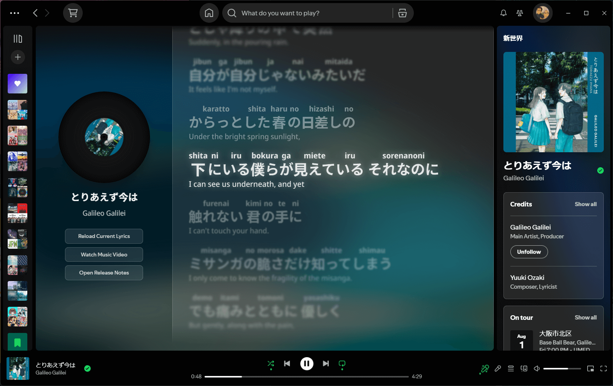
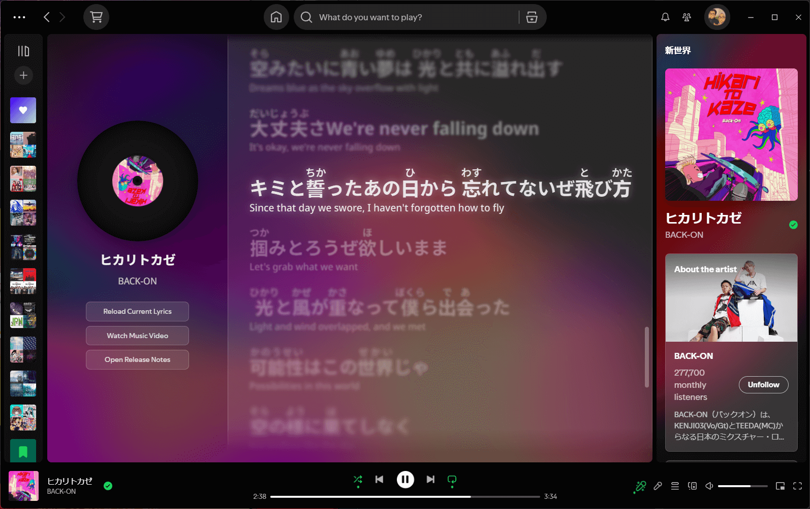
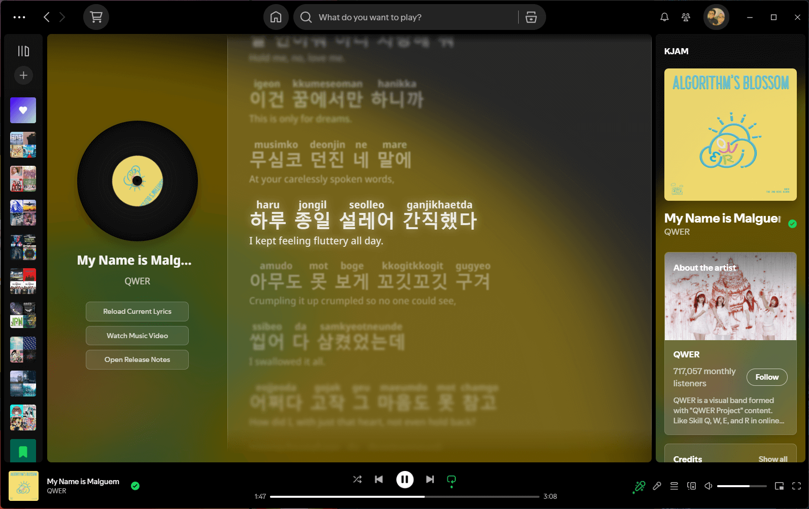

# 🎶 Amai Lyrics

Welcome! **Amai Lyrics** is an extension for [Spicetify](https://spicetify.app/) that helps you enjoy Japanese and Korean songs on Spotify. It adds Furigana to help you read Kanji, shows Romaji and Korean Romanization so you can follow along, and provides line-by-line translations.

Using Google's Gemini AI, it automatically generates:

- **Translations** for each line
- **Furigana** (pronunciation guides) above Kanji
- **Romaji** (Latin script) for Japanese lyrics
- **Korean Romanization** (Latin script) for Korean lyrics

—all displayed seamlessly inside Spotify. Setup is simple with your own API key, and the clean design keeps everything easy to read.

---

## 🌟 Features

- **Line-by-line Translation:** See translations for each line of lyrics.
- **Furigana Support:** Shows pronunciation guides above Kanji characters.
- **Romaji Support:** Displays Japanese lyrics in Latin letters.
- **Korean Romanization:** Shows Korean lyrics in Latin letters.
- **Gemini Integration:** Uses Google's Gemini AI to generate annotations.
- **Better Visuals:** Clean and easy-to-read design.
- **Easy Setup:** Just get an API key from [Google AI Studio](https://aistudio.google.com/app/apikey) and add it in Spotify settings (explained below).

### 🌍 Supported Translation Languages

Amai Lyrics supports translations into the following languages:

- **English**
- **Spanish**
- **French**
- **German**
- **Portuguese**
- **Chinese (Simplified)**
- **Thai**
- **Indonesian**
- **Malay**
- **Japanese**
- **Korean**

You can change the translation language in Spotify's settings after installing the extension.

---

## 👀 Preview

Here’s what it looks like:







---

## 🚀 How to Install

### Step 1: Install Spicetify (if you haven’t already)

Spicetify is a tool that lets you customize Spotify. You only need to do this once.

- **On Windows:**

  1. Open **PowerShell** (search for it in the Start menu).
  2. Copy and paste this command, then press **Enter**:

     ```powershell
     iwr -useb https://raw.githubusercontent.com/spicetify/marketplace/main/resources/install.ps1 | iex
     ```

- **On Linux or macOS:**

  1. Open your **Terminal** app.
  2. Copy and paste this command, then press **Enter**:

     ```bash
     curl -fsSL https://raw.githubusercontent.com/spicetify/cli/main/install.sh | sh
     ```

This will install Spicetify on your computer.

---

### Step 2: Download The Extension

- Download [amai-lyrics-main.js](https://github.com/hudzax/amai-lyrics/releases/latest/download/amai-lyrics-main.js)

---

### Step 3: Find Spicetify’s Config Folder

- Open your terminal or PowerShell again.
- Type this command and press **Enter**:

  ```bash
  spicetify config-dir
  ```

- This will open a folder on your computer. Inside, you’ll see an **Extensions** folder.

---

### Step 4: Add Amai Lyrics to Extensions

- Move or copy the **`amai-lyrics-main.js`** file you downloaded into the **Extensions** folder.

  

---

### Step 5: Enable it in Spicetify

- In the terminal or PowerShell, run these two commands one by one:

  ```bash
  spicetify config extensions amai-lyrics-main.js
  spicetify apply
  ```

- This tells Spicetify to use Amai Lyrics and refreshes Spotify.

- **Restart Spotify** (close it completely and open it again).

That’s it! You only need to do this once. Amai Lyrics will update itself automatically when new versions come out.

---

## ⚙️ Set Up Your Gemini API Key

Follow these steps to set up your Gemini API key:

1. **Get your API key:**
   - Visit [Google AI Studio](https://aistudio.google.com/app/apikey).
   - Sign in and create an API key (it’s free).
2. **Open Spotify settings:**
   - Open Spotify.
   - Go to **Settings** (click your profile picture > Settings).
3. **Add your API key:**

   - Scroll all the way down until you see the **API key** field.
   - Paste your Gemini API key there.

   

   _Don’t worry, your key is stored only on your computer and used just for this extension._

4. **See the lyrics:**

   - Play a song.
   - Click the lyrics icon at the bottom of Spotify.
   - Wait a few seconds — the lyrics will appear with line-by-line translation, Furigana, Romaji, or Romanization!

   

---

## 🙏 Credits

Big thanks to **Spikerko** for creating the original Spicy Lyrics extension.

And thank you for trying **Amai Lyrics**! Have fun singing along! 🎉
